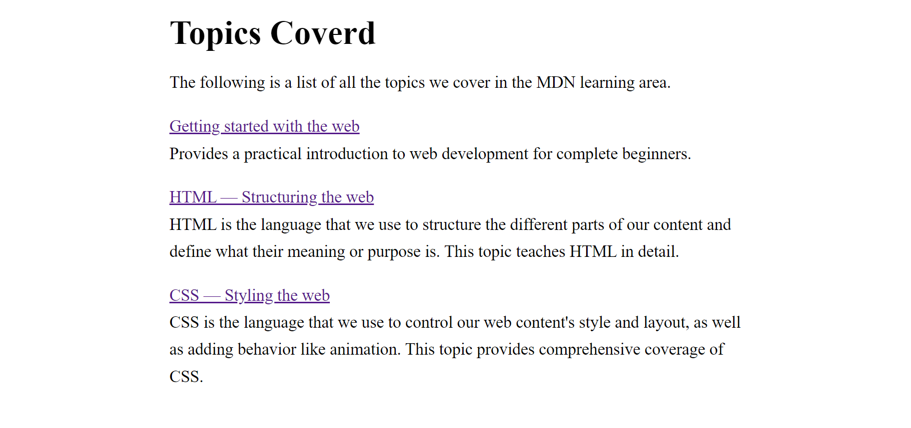

# First React Basic Project

## Description

This project serves as an introduction to React by demonstrating how to integrate React using CDN and how to use React in JavaScript.

## Features

- Integration of React through CDN link.
- Usage of React in JavaScript

## Project Image

## Hoisted Link

[Project Link :- ]
()

## Conclusion

Thank you for taking the time to explore my project. If you have any feedback, please don't hesitate to reach out to me.
